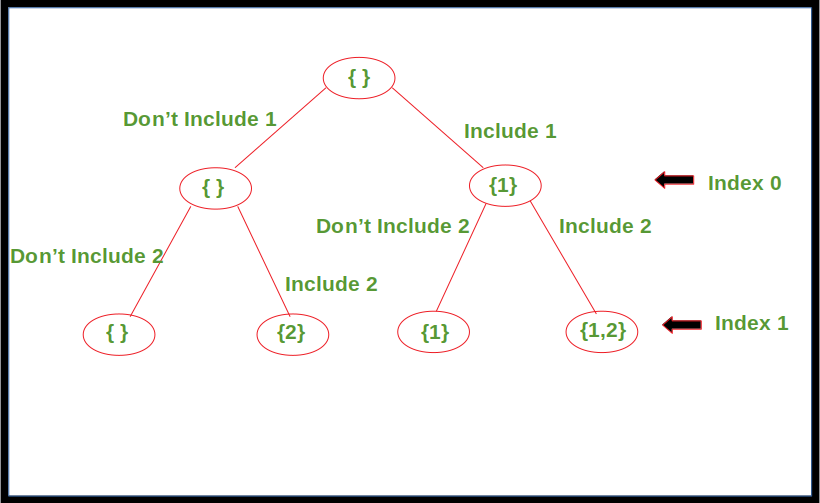

#Find All Subsequence

the code in Subsequence.java  Generates all possible Subsequences using Recursion including the empty one.

below tree show the way of getting the subsequence

Time Complexity:
O(2^n)

Space Complexity:
O(n) , Because of the recursion stack.